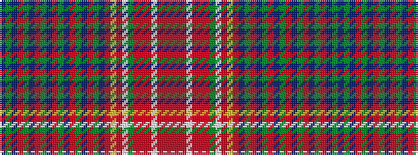

BGBRGBRGBRGBRGBRGBRYRWGRRRWRRR

It is a 30 stripe tartan.

<figure class="pat-woven">

<figcaption>idealised sample</figcaption>
</figure>

## Colour Sequence



## Tartans with this colour sequence

| Tartans |
|---------------|
| [Unidentified, Victorian fancy](/setts/s30/db12g12db4o20g12db4o20g12db4o20g12db4o20g12db4o20g12db11o24lo4o4w2dg20r8o4r5w4r5o4r8/)|
||
