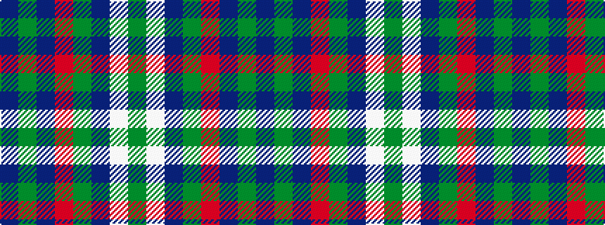

BGBRGBWG

It is a 8 stripe tartan.

<figure class="pat-woven">

<figcaption>idealised sample</figcaption>
</figure>

## Colour Sequence



## Tartans with this colour sequence

| Tartans |
|---------------|
| [Spirit of Fife (Corporate)](/variants/s8/dg10w2dt3g2m14dti26dg2dti6~x2/)|
||
