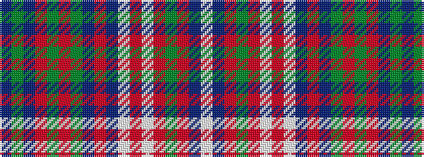

BGBRGRGBRBWRWRGRBW

It is a 18 stripe tartan.

<figure class="pat-woven">

<figcaption>idealised sample</figcaption>
</figure>

## Colour Sequence



## Tartans with this colour sequence

| Tartans |
|---------------|
| [Ensemble Pour l'Avenir](/variants/s18/db3y1db2r14y2r1y2db10r10db10w2r2w2r14y6r10db10w2~x2/)|
||
