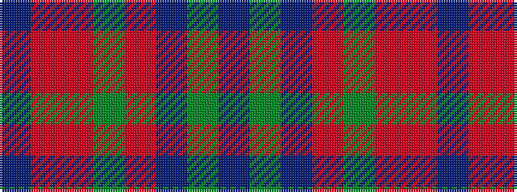

BGBRGRRB

It is a 8 stripe tartan.

<figure class="pat-woven">

<figcaption>idealised sample</figcaption>
</figure>

## Colour Sequence



## Tartans with this colour sequence

| Tartans |
|---------------|
| [Loch Rannoch](/setts/s8/dr24g2dr5o14g2o5o17dr2~x2/)|
||
