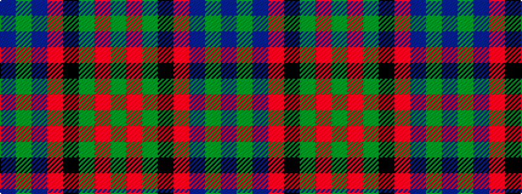

BGBRKGRG

It is a 8 stripe tartan.

<figure class="pat-woven">

<figcaption>idealised sample</figcaption>
</figure>

## Colour Sequence



## Tartans with this colour sequence

| Tartans |
|---------------|
| [Lochaber District](/variants/s8/g2r1g16k12r1t16g1t2~x2/)|
||
