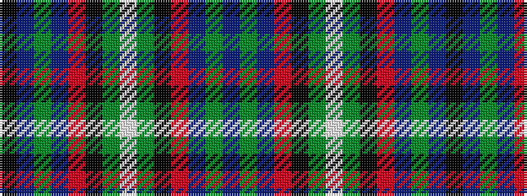

BGBRKGWGKRBGBK

It is a 14 stripe tartan.

<figure class="pat-woven">

<figcaption>idealised sample</figcaption>
</figure>

## Colour Sequence



## Tartans with this colour sequence

| Tartans |
|---------------|
| [Lambert Dress (Personal)](/setts/s14/b34g10b5r2k8dy2w3dy2k8r2b5g10b28k3~x2/)|
||
