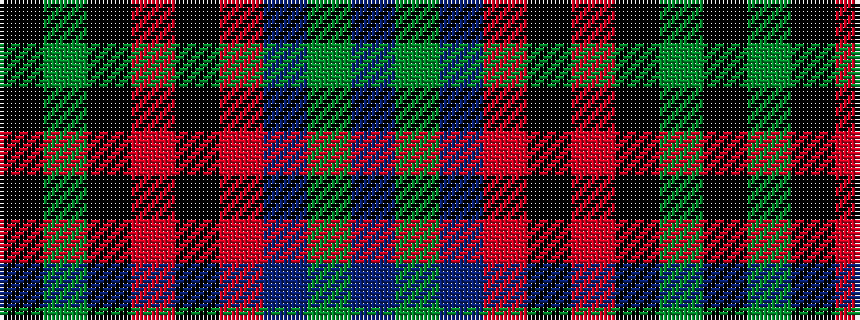

BGBRKRKGK

It is a 9 stripe tartan.

<figure class="pat-woven">

<figcaption>idealised sample</figcaption>
</figure>

## Colour Sequence



## Tartans with this colour sequence

| Tartans |
|---------------|
| [Hume or Home](/setts/s9/k3dg3k20r2k2r2db20dg3db3~x2/)|
||
| [Hume, or Home](/setts/s9/k3g3k20r2k2r2db20g3db3~x2/)|
||
