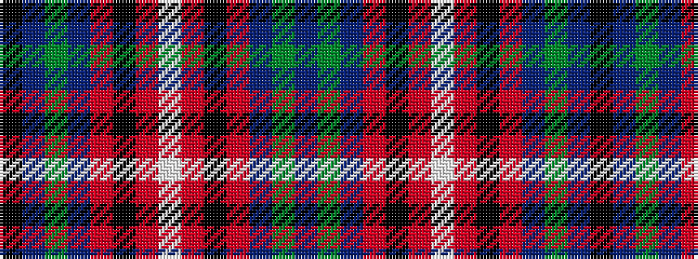

BGBRKRWRKRBGBK

It is a 14 stripe tartan.

<figure class="pat-woven">

<figcaption>idealised sample</figcaption>
</figure>

## Colour Sequence



## Tartans with this colour sequence

| Tartans |
|---------------|
| [Lambert (Front Royal) Dress](/setts/s14/t34dg10t5r2k8o2w3o2k8r2t5dg10t28k3~x2/)|
||
