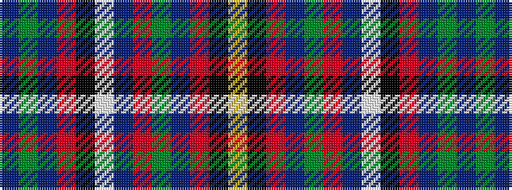

BGBRKWBRGBRKY

It is a 13 stripe tartan.

<figure class="pat-woven">

<figcaption>idealised sample</figcaption>
</figure>

## Colour Sequence



## Tartans with this colour sequence

| Tartans |
|---------------|
| [Olympic](/setts/s13/db2g6db27r2k2w2db2r24g23db2r2k2ly2~x2/)|
||
