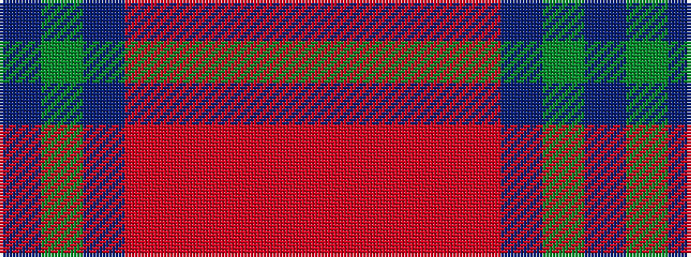

BGBRRRRR

It is a 8 stripe tartan.

<figure class="pat-woven">

<figcaption>idealised sample</figcaption>
</figure>

## Colour Sequence



## Tartans with this colour sequence

| Tartans |
|---------------|
| [Akins](/setts/s8/m21r3m3r3m3db19g22b3~x2/)|
||
| [Akins (Clan)](/setts/s8/m21r3m3r3m3db19g22t3~x2/)|
||
| [Akins Clan Tartan Tartan Number: 2426. Earliest known date: 1822 This is the `Approved` tartan for the Akins Clan See products available Copyright © Blair Urquhart, Comrie, 2015](/setts/s8/r12r4r4r4r4dt11dg12t4~x2/)|
||
