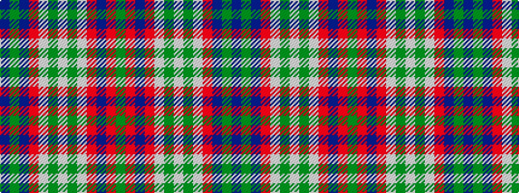

BGBRWGWGWRBRG

It is a 13 stripe tartan.

<figure class="pat-woven">

<figcaption>idealised sample</figcaption>
</figure>

## Colour Sequence



## Tartans with this colour sequence

| Tartans |
|---------------|
| [Saint John New Brunswick](/variants/s13/g1r2t12r15w15g3w1g3w15r15t3dy12t1~x2/)|
||
