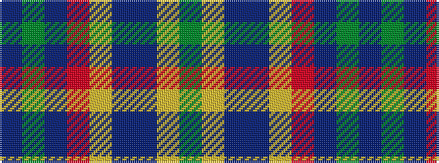

BGBRYBBYG

It is a 9 stripe tartan.

<figure class="pat-woven">

<figcaption>idealised sample</figcaption>
</figure>

## Colour Sequence



## Tartans with this colour sequence

| Tartans |
|---------------|
| [Crichton (Clan)](/variants/s9/db80dg1db2r4lr1n5db8lo2dg2~x2/)|
||
