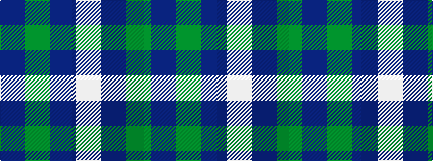

BGBW

It is a 4 stripe tartan.

<figure class="pat-woven">

<figcaption>idealised sample</figcaption>
</figure>

## Colour Sequence



## Tartans with this colour sequence

This pattern is a design lineage: every tartan below shares one colour order, whatever its owner —
near-identical designs are grouped, the largest lineage first (#112: the pattern is a tartan's
second parent, beside its family or clan).

<table class="sett-table">
<tbody>
<tr><td><a href="/tartans/b/bl/blue-meadow/">Blue Meadow</a></td></tr>
<tr><td class="sett-swatch"></td></tr>
<tr><td><a href="/tartans/u/un/unidentified-no-78/">Unidentified No 78</a></td></tr>
<tr><td class="sett-swatch"></td></tr>
<tr class="cluster-sep"><td></td></tr>
<tr><td><a href="/tartans/j/ju/justus-international/">Justus International</a></td></tr>
<tr><td class="sett-swatch"></td></tr>
<tr class="cluster-sep"><td></td></tr>
<tr><td><a href="/tartans/l/lu/lucard-st-phane/">Lucard, Stéphane</a></td></tr>
<tr><td class="sett-swatch"></td></tr>
<tr class="cluster-sep"><td></td></tr>
<tr><td><a href="/tartans/n/no/norwich-university-regimental/">Norwich University Regimental</a></td></tr>
<tr><td class="sett-swatch"></td></tr>
<tr class="cluster-sep"><td></td></tr>
<tr><td><a href="/tartans/o/ou/outlander-3/">Outlander</a></td></tr>
<tr><td class="sett-swatch"></td></tr>
</tbody>
</table>

