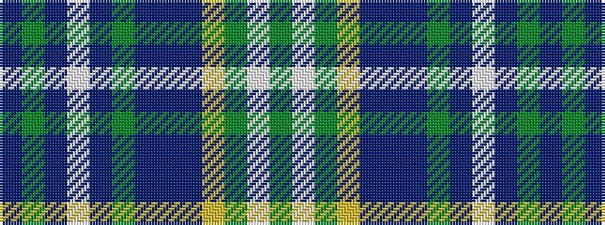

BGBWBGBBBYGWG

It is a 13 stripe tartan.

<figure class="pat-woven">

<figcaption>idealised sample</figcaption>
</figure>

## Colour Sequence



## Tartans with this colour sequence

| Tartans |
|---------------|
| [Riyadh Caledonian (Corporate)](/variants/s13/db23g4db1w1db3g5db1dp4db3ly1g3w1g4~x4/)|
||
