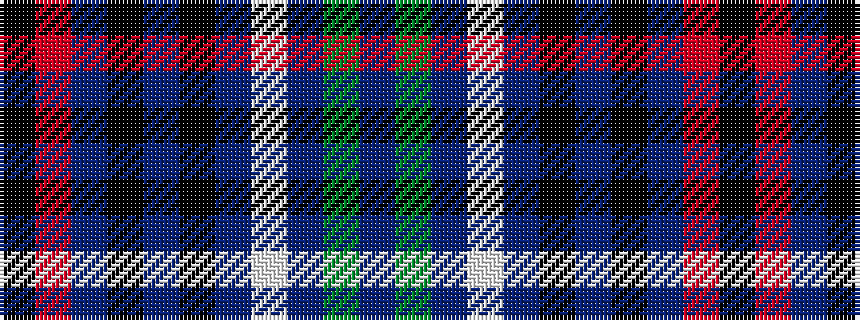

BGBWBKBKBRK

It is a 11 stripe tartan.

<figure class="pat-woven">

<figcaption>idealised sample</figcaption>
</figure>

## Colour Sequence



## Tartans with this colour sequence

| Tartans |
|---------------|
| [Pearl O' the Tay (Corporate)](/setts/s11/dt6g3dt3w2dt5k2dt3k2dp16m3k2~x2/)|
||
