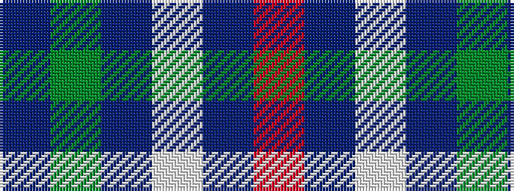

BGBWBR

It is a 6 stripe tartan.

<figure class="pat-woven">

<figcaption>idealised sample</figcaption>
</figure>

## Colour Sequence



## Tartans with this colour sequence

| Tartans |
|---------------|
| [Thayer USA](/setts/s6/r5db25w5db3dg25db3~x2/)|
||
| [Thayer USA (Name)](/setts/s6/r5db25w5db3g25db3~x2/)|
||
