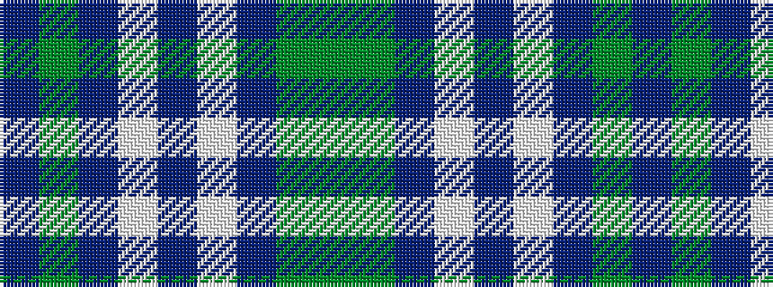

BGBWBWBGG

It is a 9 stripe tartan.

<figure class="pat-woven">

<figcaption>idealised sample</figcaption>
</figure>

## Colour Sequence



## Tartans with this colour sequence

| Tartans |
|---------------|
| [Mounth, The](/variants/s9/dg2y13db12w3db10w3db12g13dp2~x2/)|
||
