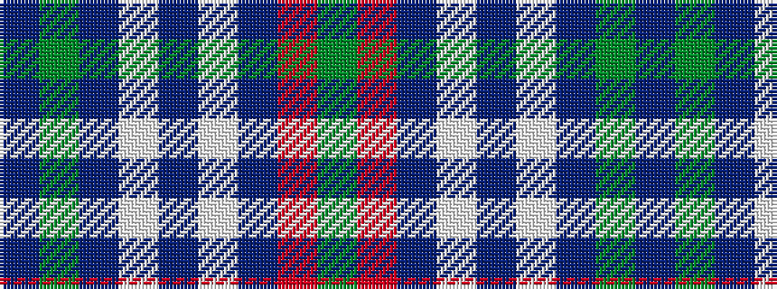

BGBWBWBRG

It is a 9 stripe tartan.

<figure class="pat-woven">

<figcaption>idealised sample</figcaption>
</figure>

## Colour Sequence



## Tartans with this colour sequence

| Tartans |
|---------------|
| [Mounth, The](/setts/s9/dp2g13b12w3b10w3b12o13g2~x2/)|
||
