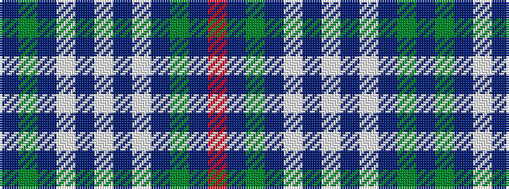

BGBWBWBWBGBR

It is a 12 stripe tartan.

<figure class="pat-woven">

<figcaption>idealised sample</figcaption>
</figure>

## Colour Sequence



## Tartans with this colour sequence

| Tartans |
|---------------|
| [Ikelman #5 (Personal)](/variants/s12/db15g2db2w1db1w1db1w1db2g2db15r10~x4/)|
||
