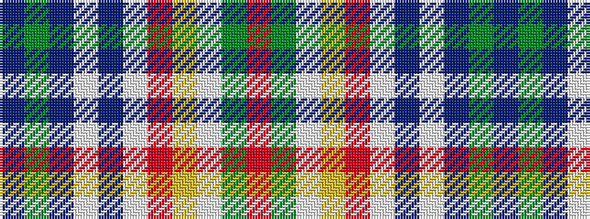

BGBWBWRYWGR

It is a 11 stripe tartan.

<figure class="pat-woven">

<figcaption>idealised sample</figcaption>
</figure>

## Colour Sequence



## Tartans with this colour sequence

| Tartans |
|---------------|
| [Belwade](/variants/s11/dbi4g4dbi4w1db1w1m4lo4w1g4m4~x4/)|
||
