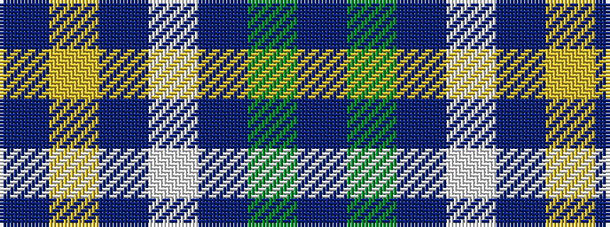

BGBWBYB

It is a 7 stripe tartan.

<figure class="pat-woven">

<figcaption>idealised sample</figcaption>
</figure>

## Colour Sequence



## Tartans with this colour sequence

| Tartans |
|---------------|
| [Justus International](/variants/s7/p2g1p1w1p1ly1p2~x24/)|
||
| [Justus International (Personal)](/variants/s7/dp2dg1dp1w1dp1ly1dp2~x24/)|
||
| [Justus International Tartan](/variants/s7/dp2g1dp1w1dp1ly1dp2~x6/)|
||
