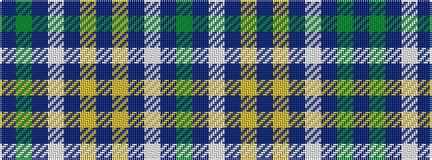

BGBWBYBYBWBG

It is a 12 stripe tartan.

<figure class="pat-woven">

<figcaption>idealised sample</figcaption>
</figure>

## Colour Sequence



## Tartans with this colour sequence

| Tartans |
|---------------|
| [Justus International (Personal)](/setts/s12/dp2dg1dp1w1dp1ly1dp2~x24/)|
||
