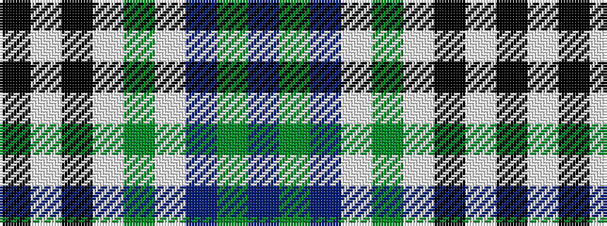

BGBWGWKWK

It is a 9 stripe tartan.

<figure class="pat-woven">

<figcaption>idealised sample</figcaption>
</figure>

## Colour Sequence



## Tartans with this colour sequence

| Tartans |
|---------------|
| [Burns Heritage Check](/setts/s9/k12w12k12w12g13w8dr6g4dr5/)|
||
