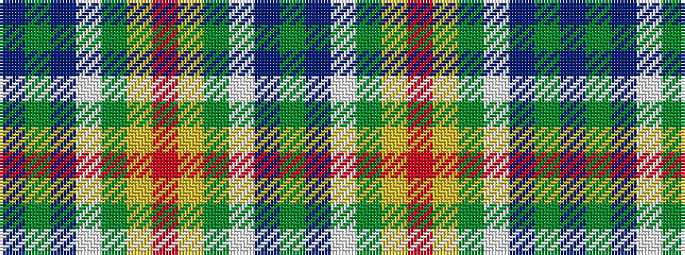

BGBWGYRYGWBG

It is a 12 stripe tartan.

<figure class="pat-woven">

<figcaption>idealised sample</figcaption>
</figure>

## Colour Sequence



## Tartans with this colour sequence

| Tartans |
|---------------|
| [Unidentified #25](/setts/s12/r4lo27dy9w2b2dy2b4~x3/)|
||
