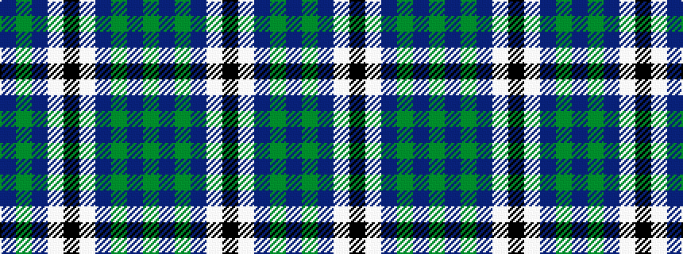

BGBWKWBGBG

It is a 10 stripe tartan.

<figure class="pat-woven">

<figcaption>idealised sample</figcaption>
</figure>

## Colour Sequence



## Tartans with this colour sequence

| Tartans |
|---------------|
| [Crombie House Check Corporate Tartan](/variants/s10/db18g6db2lb10k3lb10db2g6db18g2~x2/)|
||
