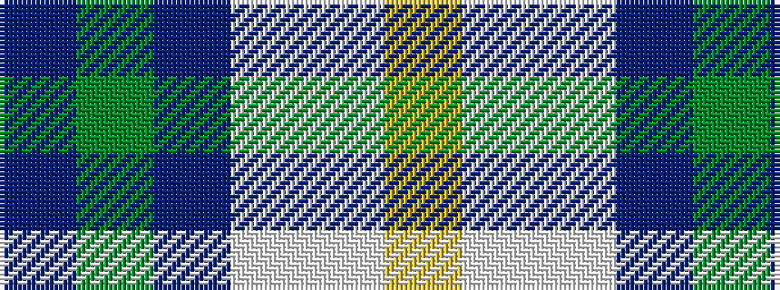

BGBWWY

It is a 6 stripe tartan.

<figure class="pat-woven">

<figcaption>idealised sample</figcaption>
</figure>

## Colour Sequence



## Tartans with this colour sequence

| Tartans |
|---------------|
| [Greenup (2015)](/setts/s6/do8g50t4lb2w5ly2~x2/)|
||
