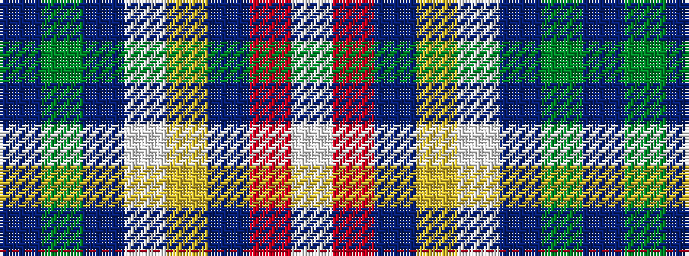

BGBWYBRW

It is a 8 stripe tartan.

<figure class="pat-woven">

<figcaption>idealised sample</figcaption>
</figure>

## Colour Sequence



## Tartans with this colour sequence

| Tartans |
|---------------|
| [St. Petersburg City (District)](/variants/s8/db60g10db3lb6ly2db9r2w2~x2/)|
||
