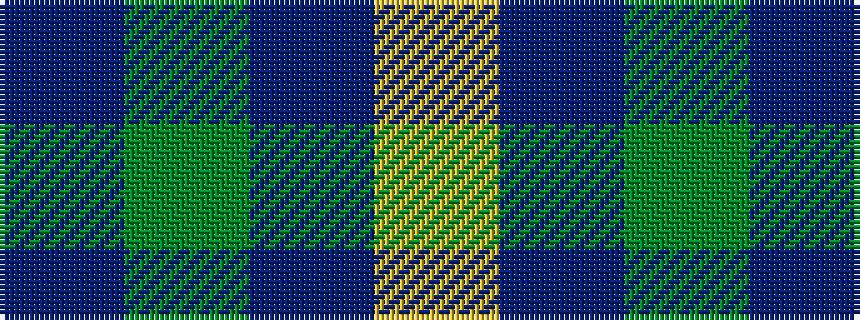

BGBY

It is a 4 stripe tartan.

<figure class="pat-woven">

<figcaption>idealised sample</figcaption>
</figure>

## Colour Sequence



## Tartans with this colour sequence

| Tartans |
|---------------|
| [Laurel Park](/setts/s4/t48g25t13ly5~x2/)|
||
| [Loch Garth](/setts/s4/do12y6do2lo1~x4/)|
||
| [Oxford University (Corporate)](/setts/s4/db9g16db59ly4~x2/)|
||
