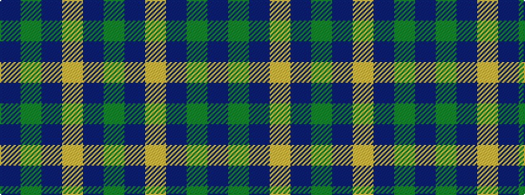

BGBYBG

It is a 6 stripe tartan.

<figure class="pat-woven">

<figcaption>idealised sample</figcaption>
</figure>

## Colour Sequence



## Tartans with this colour sequence

| Tartans |
|---------------|
| [Oxford University](/setts/s6/g16db59ly4db59g16dbi9~x2/)|
||
