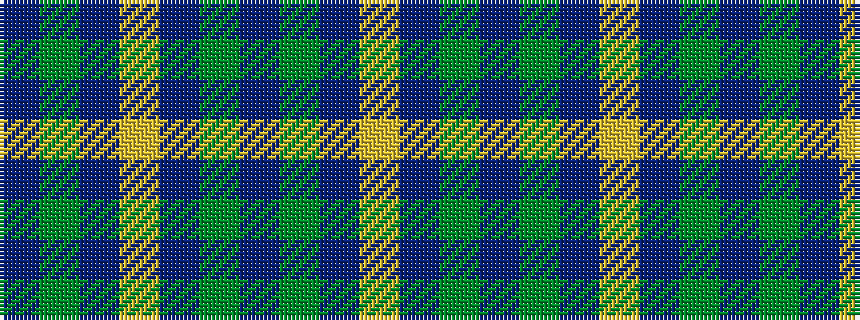

BGBYBGBGBY

It is a 10 stripe tartan.

<figure class="pat-woven">

<figcaption>idealised sample</figcaption>
</figure>

## Colour Sequence



## Tartans with this colour sequence

| Tartans |
|---------------|
| [Pinney's of Scotland](/variants/s10/db4g2dbi10ly1dbi2g13db11g13dbi13ly2~x2/)|
||
