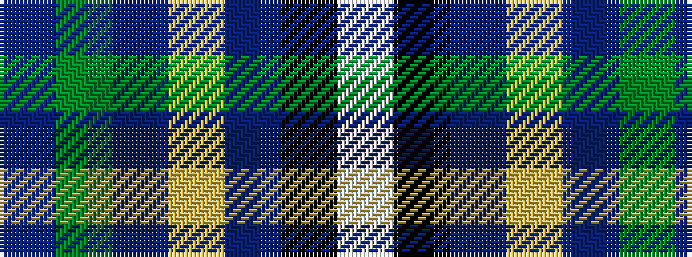

BGBYBKW

It is a 7 stripe tartan.

<figure class="pat-woven">

<figcaption>idealised sample</figcaption>
</figure>

## Colour Sequence



## Tartans with this colour sequence

| Tartans |
|---------------|
| [Bro-sant-Brieg](/setts/s7/dt3g6dt2ly3dt42k6w3~x2/)|
||
