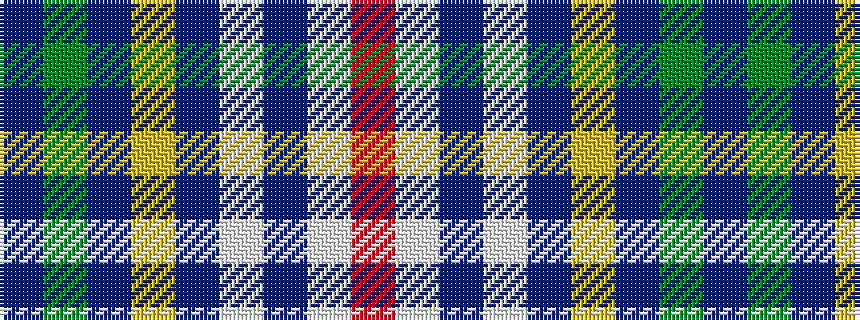

BGBYBWBWR

It is a 9 stripe tartan.

<figure class="pat-woven">

<figcaption>idealised sample</figcaption>
</figure>

## Colour Sequence



## Tartans with this colour sequence

| Tartans |
|---------------|
| [Eastern States Exposition-West Springfield](/setts/s9/dp1g1b2ly1b16lb16b1w2r1~x4/)|
||
