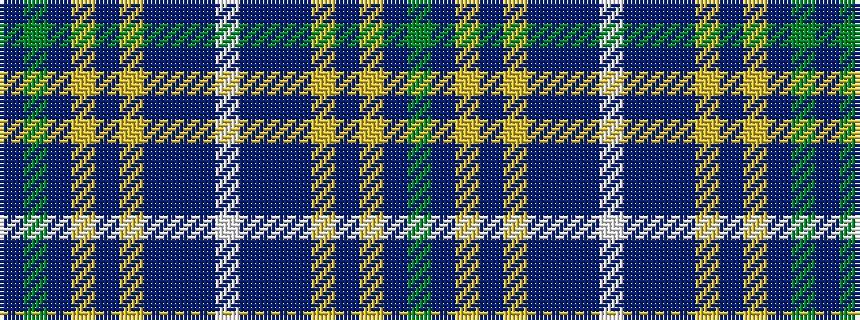

BGBYBYBBBWBBBYBYBG

It is a 18 stripe tartan.

<figure class="pat-woven">

<figcaption>idealised sample</figcaption>
</figure>

## Colour Sequence



## Tartans with this colour sequence

| Tartans |
|---------------|
| [Highland Blue](/variants/s18/g13db5ly3t6ly3db5n6db28w2db28n6db5ly3t6ly3db5g13dp4~x2/)|
||
