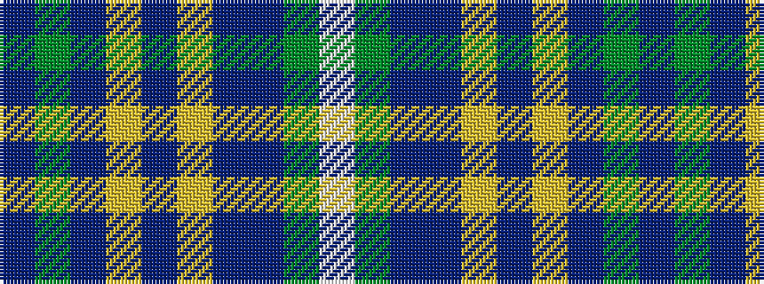

BGBYBYBBGW

It is a 10 stripe tartan.

<figure class="pat-woven">

<figcaption>idealised sample</figcaption>
</figure>

## Colour Sequence



## Tartans with this colour sequence

| Tartans |
|---------------|
| [Highland, Green (Corporate)](/variants/s10/dp4g13db5ly3t6ly3db5n6g28w2~x2/)|
||
