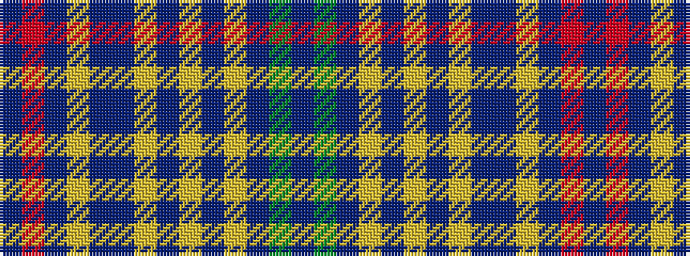

BGBYBYBYBBYBRB

It is a 14 stripe tartan.

<figure class="pat-woven">

<figcaption>idealised sample</figcaption>
</figure>

## Colour Sequence



## Tartans with this colour sequence

| Tartans |
|---------------|
| [RAF Kinloss (Military)](/setts/s14/t10r4t44lr8t8t4lr4t4lr50t8lr6t5g4t6/)|
||
