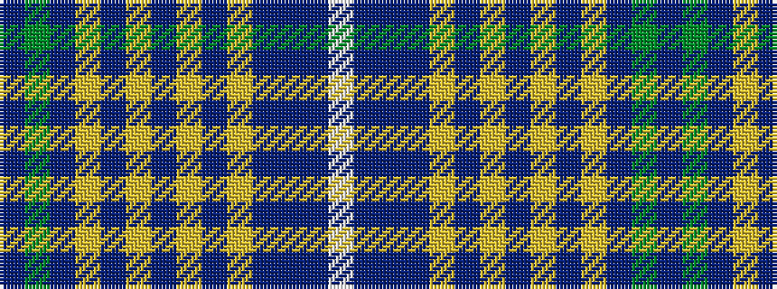

BGBYBYBYBYBBBW

It is a 14 stripe tartan.

<figure class="pat-woven">

<figcaption>idealised sample</figcaption>
</figure>

## Colour Sequence



## Tartans with this colour sequence

| Tartans |
|---------------|
| [Crombie, Harry (Personal)](/setts/s14/dp5g1db30lg2db4lg3db3lg4db2lg5db2b9db1w2~x2/)|
||
