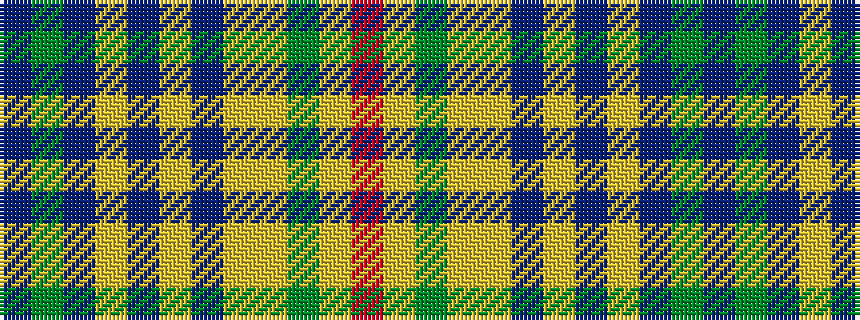

BGBYBYBYYGYR

It is a 12 stripe tartan.

<figure class="pat-woven">

<figcaption>idealised sample</figcaption>
</figure>

## Colour Sequence



## Tartans with this colour sequence

| Tartans |
|---------------|
| [Harmony 1 Trade Tartan](/variants/s12/do11g3do4ly3do3ly4do3ly13lo34g3lo4r3~x2/)|
||
