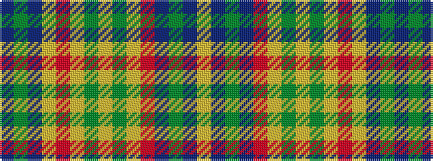

BGBYRYGYGYRBGBY

It is a 15 stripe tartan.

<figure class="pat-woven">

<figcaption>idealised sample</figcaption>
</figure>

## Colour Sequence



## Tartans with this colour sequence

| Tartans |
|---------------|
| [el Corte](/setts/s15/ly6t5g4t5r2ly5g2ly14g10ly1r30ly10t14g5t2~x2/)|
||
