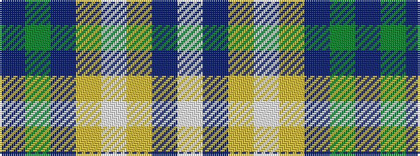

BGBYWYBW

It is a 8 stripe tartan.

<figure class="pat-woven">

<figcaption>idealised sample</figcaption>
</figure>

## Colour Sequence



## Tartans with this colour sequence

| Tartans |
|---------------|
| [Evergreen](/setts/s8/w2do30lo10w1lo10do1y10do1~x4/)|
||
