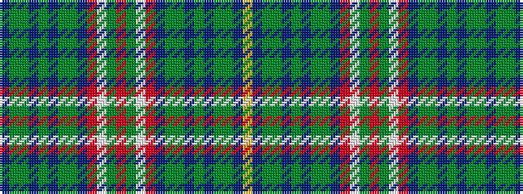

BGGBGBGGBRWGRGWRBGGBGBGGBY

It is a 26 stripe tartan.

<figure class="pat-woven">

<figcaption>idealised sample</figcaption>
</figure>

## Colour Sequence



## Tartans with this colour sequence

| Tartans |
|---------------|
| [McGran (Personal)](/variants/s26/dp3g3gi32dp2gi4dp4gi3g10dp2r2w1g1r3g1w1r2dp2g10gi3dp4gi4dp2gi32g3dp3lo2~x2/)|
||
