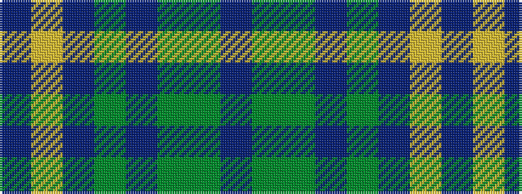

BGGBGBYB

It is a 8 stripe tartan.

<figure class="pat-woven">

<figcaption>idealised sample</figcaption>
</figure>

## Colour Sequence



## Tartans with this colour sequence

| Tartans |
|---------------|
| [Heather Mead (Personal)](/setts/s8/dpi13dg16g4dp1g4dp34ly1dp1~x2/)|
||
