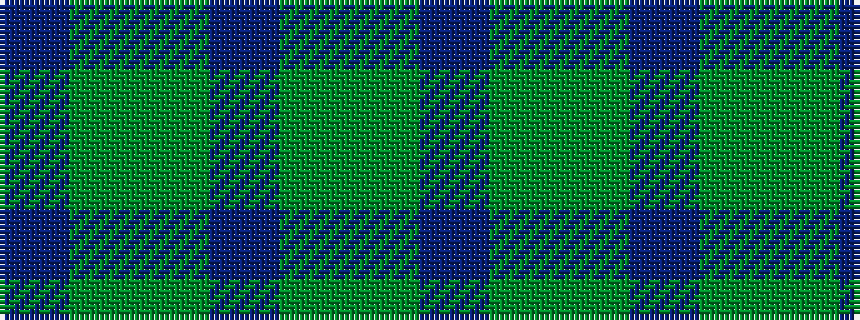

BGGBGGB

It is a 7 stripe tartan.

<figure class="pat-woven">

<figcaption>idealised sample</figcaption>
</figure>

## Colour Sequence



## Tartans with this colour sequence

| Tartans |
|---------------|
| [Valley of the Green](/variants/s7/t4gii26gi8t8gi8g3t2~x2/)|
||
| [Valley of the Green (The ) Canadian Tartan](/variants/s7/t4dg26gi8t8gi8g3t2~x2/)|
||
| [Valley, of the Green. (The )](/variants/s7/t4dg26g8t8g8gi3t2~x2/)|
||
