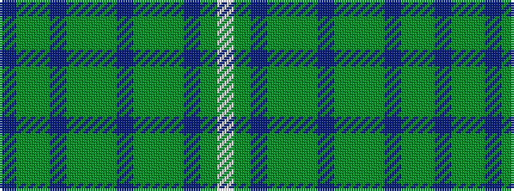

BGGBGGGBGGGBGW

It is a 14 stripe tartan.

<figure class="pat-woven">

<figcaption>idealised sample</figcaption>
</figure>

## Colour Sequence



## Tartans with this colour sequence

| Tartans |
|---------------|
| [MacKinnon 4](/variants/s14/p2y3g2db2y6g16y2db4g2y16g8p2y4w2~x2/)|
||
