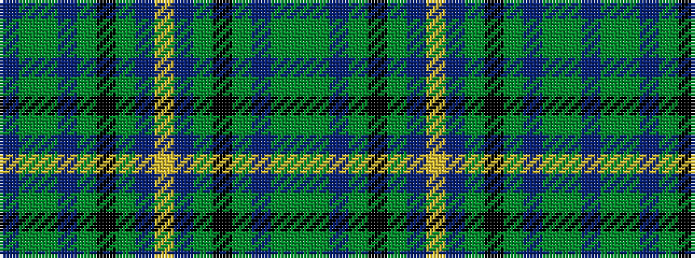

BGGBGKGBYBGKGBGG

It is a 16 stripe tartan.

<figure class="pat-woven">

<figcaption>idealised sample</figcaption>
</figure>

## Colour Sequence



## Tartans with this colour sequence

| Tartans |
|---------------|
| [Suzugamine](/variants/s16/dy5g19dp5dy5k5dy5db36ly3db36dy5k5dy5dp5g19dy5db4~x2/)|
||
