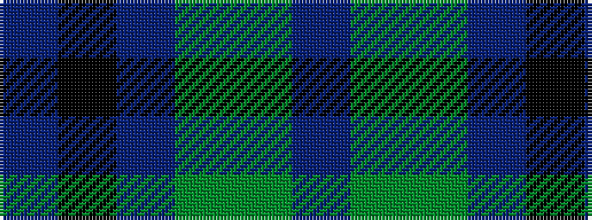

BGGBKB

It is a 6 stripe tartan.

<figure class="pat-woven">

<figcaption>idealised sample</figcaption>
</figure>

## Colour Sequence



## Tartans with this colour sequence

| Tartans |
|---------------|
| [MacTavish Hunting](/variants/s6/t4dy28g6t12k12t3~x2/)|
||
| [MacTavish Hunting Clan Tartan](/variants/s6/t3dy26g4t13k13t2~x2/)|
||
| [Thompson/Thomson/MacTavish Hunting](/variants/s6/t4dy28dg6t12k12t3~x2/)|
||
