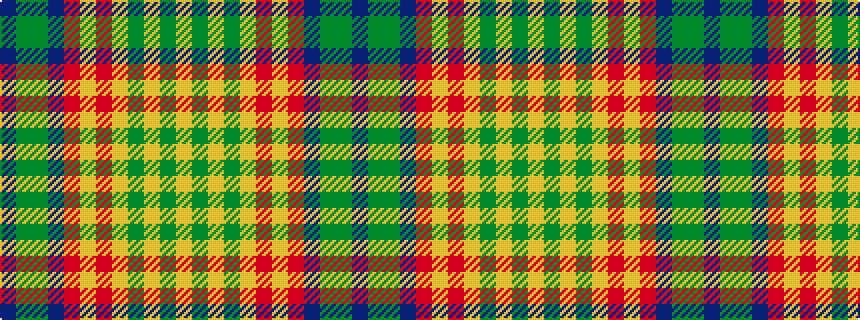

BGGBRYRYGYGY

It is a 12 stripe tartan.

<figure class="pat-woven">

<figcaption>idealised sample</figcaption>
</figure>

## Colour Sequence



## Tartans with this colour sequence

| Tartans |
|---------------|
| [Rainbow (Canada)](/variants/s12/db6gi2g4db12r3lr2r8lr3g6lr3g6lr3~x2/)|
||
