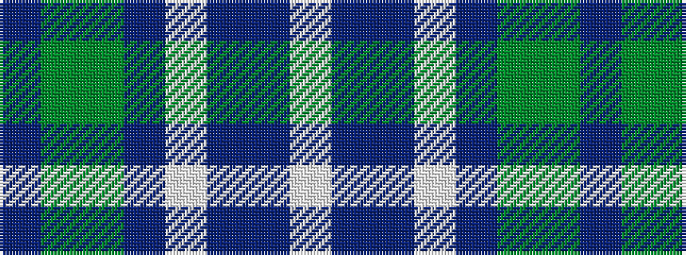

BGGBWBBW

It is a 8 stripe tartan.

<figure class="pat-woven">

<figcaption>idealised sample</figcaption>
</figure>

## Colour Sequence



## Tartans with this colour sequence

| Tartans |
|---------------|
| [Hummelt, Katherine (Personal)](/setts/s8/db11dg10y6db7lt2db3dp10lt2~x2/)|
||
