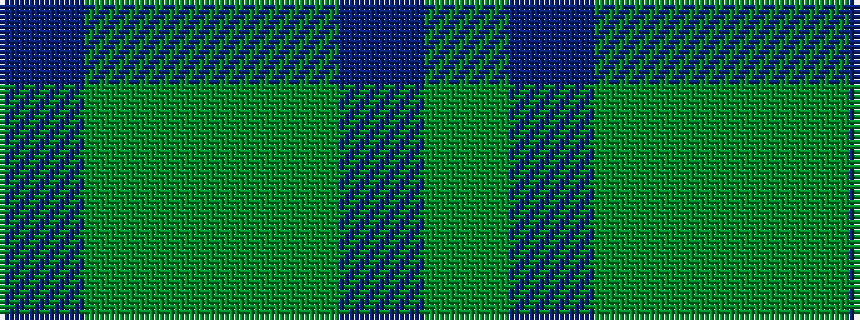

BGGGBG

It is a 6 stripe tartan.

<figure class="pat-woven">

<figcaption>idealised sample</figcaption>
</figure>

## Colour Sequence



## Tartans with this colour sequence

| Tartans |
|---------------|
| [Walters (Personal)](/variants/s6/g2dp2g20g2g2dp1~x4/)|
||
