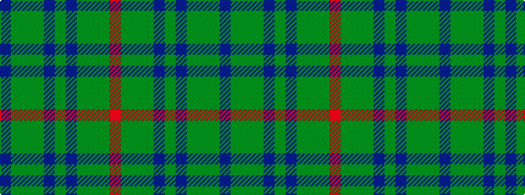

BGGGBGBGGGR

It is a 11 stripe tartan.

<figure class="pat-woven">

<figcaption>idealised sample</figcaption>
</figure>

## Colour Sequence



## Tartans with this colour sequence

| Tartans |
|---------------|
| [Buchanan Hunting](/variants/s11/db3dy14dg14dy2db14dy2db14dy2dg14dy14r3~x2/)|
||
