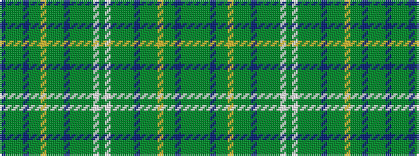

BGGGBGGYGGGBGGGGWGWGGGGBGGGYGGBGGG

It is a 34 stripe tartan.

<figure class="pat-woven">

<figcaption>idealised sample</figcaption>
</figure>

## Colour Sequence



## Tartans with this colour sequence

| Tartans |
|---------------|
| [Hebrides South Uist #2](/setts/s34/db19y2g3y2db2y20g1ly1y1g2y2db18y2g2y22g3w1y3~x2/)|
||
